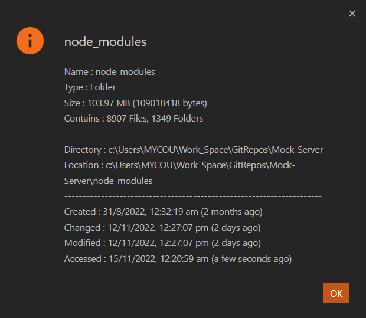
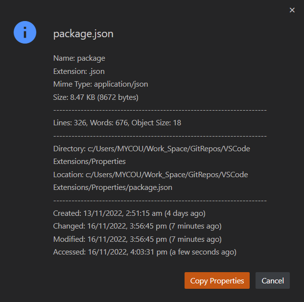
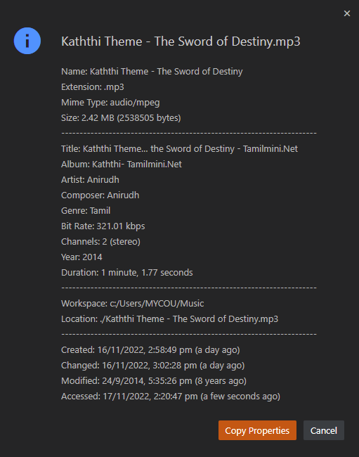
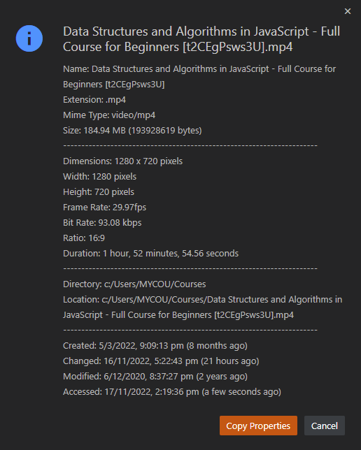

# Properties

Get file or Folder Properties.

- File `Name` and `Extension`.
- File or Folder `Size`.
- File `Mime Type`.
- Number of selected `Lines`, `Words`, `Object Size`, `Array Length`, `Nodes`, `Child Nodes`.
- Folders `Contains`.
- Image `Dimensions`, `Resolution`, `Bit Depth`, `Color Type`, `Sub Sampling`, `Compression`, `Filter`, `Resource URL`.
- File or Folder `Workspace`, `Directory` and `Location`.
- Audio `Title`, `Album`, `Artist`, `Composer`, `Genre`, `Bit Rate`, `Channels`, `Year`, `Duration`.
- Video `Dimensions`, `Frame Rate`, `Bit Rate`, `Ratio`, `Duration`.
- Timestamp of `created`, `changed`, `modified`, `accessed` with relative timestamp .
- Copy properties or location

  

    <h2>Folder Properties</h2>
    
  

  

    <h2>File Properties</h2>
    
  

  

    <h2>Image Properties</h2>
    
  

  

    <h2>Audio Properties</h2>
    
  

  

    <h2>Video Properties</h2>
    
  

## Usage

- Right click on any file or folder and select `Properties` from context menu to get the properties.

- Set custom timestamp using `properties.settings.dateTimeFormat`. For more date time formate please click [here](https://www.npmjs.com/package/dateformat#mask-options)
- We can change copy action in setting using `properties.settings.copyAction` to `Location` to copy only file or folder path.
- The selection details may not show if the current active file size is greater than `20mb` due to vscode limitations.
- The `Extension` and `Mime Type` will only show to file properties and will be hidden in folder properties

## Author

Sivaraman - [sendmsg2siva.siva@gmail.com](sendmsg2siva.siva@gmail.com)

## License

MIT
