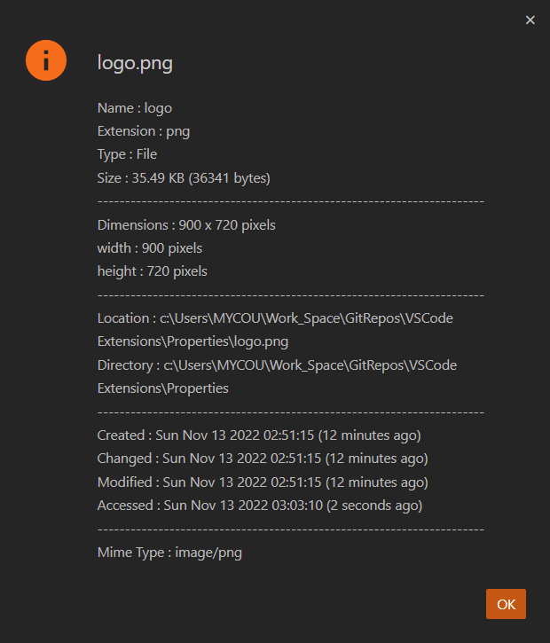

# Properties

Get file or Folder Properties.

- File or Folder size
- Mime Type
- Image dimensions. `width` x `height`
- File Extension
- File or Folder Location
- File or Folder Directory path
- Created Timestamp
- Changed Timestamp
- Modified Timestamp
- Accessed Timestamp

## Usage

- Right click on any file or folder and select `Properties` from context menu to get the properties.
- Set custom timestamp using `properties.settings.dateTimeFormat`.
- Enable or disable relative timestamp using `properties.settings.disableRelativeTimestamps`.

## Author

Sivaraman - [sendmsg2siva.siva@gmail.com](sendmsg2siva.siva@gmail.com)

## License

MIT
